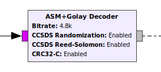

# gr-sattools

## pybombs recipe
```
category: common
depends: 
- gnuradio
- zeromq
source: git+https://github.com/mndza/gr-sattools.git
gitbranch: master
inherit: cmake
description: GNURadio OOT module with tools for satellite decoding
```

## manual build

System should meet the following dependencies:

- gnuradio >=3.7.12
- zeromq (optional)

Follow the usual GNURadio OOT module installation steps:

```
mkdir build/
cd build
cmake ../
make -j4
make install
```
**NOTE:** There is a CMake option to disable ZeroMQ-dependent blocks, in case you do not need them:
```
cmake -DENABLE_SATTOOLS_ZEROMQ=OFF ../
```

## usage
see `examples/` directory

## blocks

### ASM+Golay Decoder



Decoder for ASM+Golay mode.

* **Input**: raw bitstream from the demodulator in unpacked bytes (1 bit/byte). 

* **Output**: messages containing CSP packets, which can be fed to the CSP zmqhub PUB sink block.

This is a hierarchical block roughly equivalent to the following blocks.


### Async CRC32-Castagnoli

Computes or checks CRC32-Castagnoli in async messages.

### Golay24 Decoder

Block used for header decoding in ASM+Golay mode. Expects 24 unpacked bits 
in the input port, which then are decoded using extended binary Golay code.
* If decoding is **successful**, a message is sent with a dictionary containing 
all tags from the input and a `frame_len` pair containing the frame length in bits.
* If decoding **fails**, a `PMT_F` message is sent.

### Reed-Solomon CCSDS Decoder

Decodes async messages using CCSDS Reed-Solomon variant (**NO** dual-basis representation).

### CSP zmqhub PUB sink

This block depends on ZeroMQ.
Connects PDUs containing CSP packets to a zmqhub interface from libcsp.